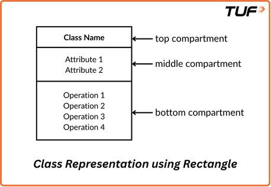
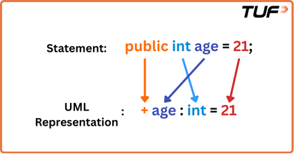
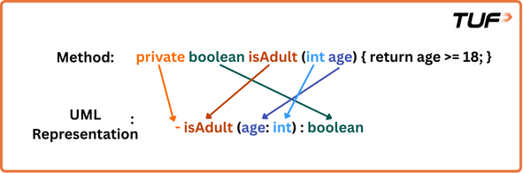
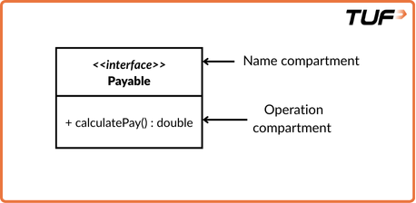
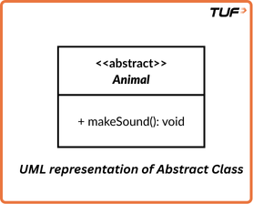
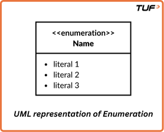
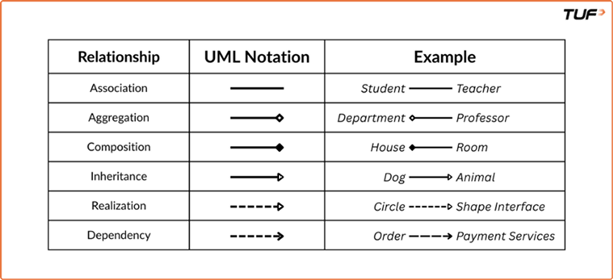

**Class representation:**

   A class in UML is depicted as a rectangle divided into three compartments:
   Top compartment: Contains the class name (bold and centered).
   Middle compartment: Lists the attributes.
   Bottom compartment: Lists the operations (methods).



**Visibility Markers:**

Visibility markers define access levels for attributes and operations:

- Public (+): Accessible from any other class.
- Private (-): Accessible only within the class itself.
- Protected (#): Accessible within the class and its subclasses.
- Package (~): Accessible within the same package.

**Attributes and Method System:**

Attributes:
- visibility name: Type [multiplicity] = DefaultValue
  - visibility: The visibility marker (e.g., +, -, #, ~).
  - name: The name of the attribute.
  - Type: The data type of the attribute (e.g., int, String).
  - multiplicity: An optional field indicating how many instances of the attribute can exist (e.g., 0..1, 1..*, etc.).
  - DefaultValue: An optional default value for the attribute.



Methods (Operations):
- visibility name(parameterName1: Type1,...): ReturnType
  - visibility: The visibility marker (e.g., +, -, #, ~).
  - name: The name of the method.
  - parameterName1: The name of the first parameter.
  - Type1: The data type of the first parameter.
  - ReturnType: The data type of the return value.

```java
class Person {
    private boolean isAdult(int age) { 
        return age >= 18; 
    }
}
```



**Interface:**

```java
// Interface for classes that can calculate pay
public interface Payable {
    
    // Method to calculate pay
    double calculatePay();
}
```



**Abstract Classes:**

```java
// Abstract class representing an Animal
public abstract class Animal {

    // Abstract method to make sound
    public abstract void makeSound();
}
```


**Enums:**




---

### Relationship Between Classes

**1. Association (USE-A)**

   (I have you) -
   Association represents a general relationship between two classes where one class uses or interacts with another. It can be: one-to-one, one-to-many or many-to-many.

   Example: A teacher can teach multiple students, and a student can be taught by multiple teachers (many-to-many association).
   UML Notation: A solid line between the two classes.

**2. Aggregation (HAS-A)**

   (I have you, but you are not mine) - Aggregation is a "whole-part" relationship where a class is made up of one or more classes, but those parts can exist independently.

   Example: A Department has multiple Professors. If the department is removed, the professors still exist.
   UML Notation: A hollow diamond at the container (whole) class.

**3. Composition (Strong HAS-A)**

   (You are mine & only mine) - Composition is a stronger form of aggregation where the part cannot exist without the whole. It is a "whole-part" relationship where the part is dependent on the whole.

   Example: A House has Rooms. If the House is destroyed, so are the Rooms.
   UML Notation: A filled diamond at the whole side.

**4. Inheritance**

   Inheritance defines an IS-A relationship where a subclass inherits properties and behavior from a superclass. The subclass can extend or override the superclass's attributes and methods.

   Example: A Dog is an Animal.
   UML Notation: A solid line with a hollow triangle pointing to the parent class.

**5. Realization (Implementation)**

   Realization is the relationship between a class and an interface. The class agrees to implement the behavior declared by the interface.

   Example: A Circle class implements the Shape interface.
   UML Notation: A dashed line with a hollow triangle pointing to the interface.

**6. Dependency**
   
   Dependency indicates that a class uses another class temporarily. Changes to the used class may affect the dependent class.

   Example: OrderService depends on PaymentService to process payments.
   UML Notation: A dashed line with an open arrow pointing to the class being used.

**Summary Table:**

